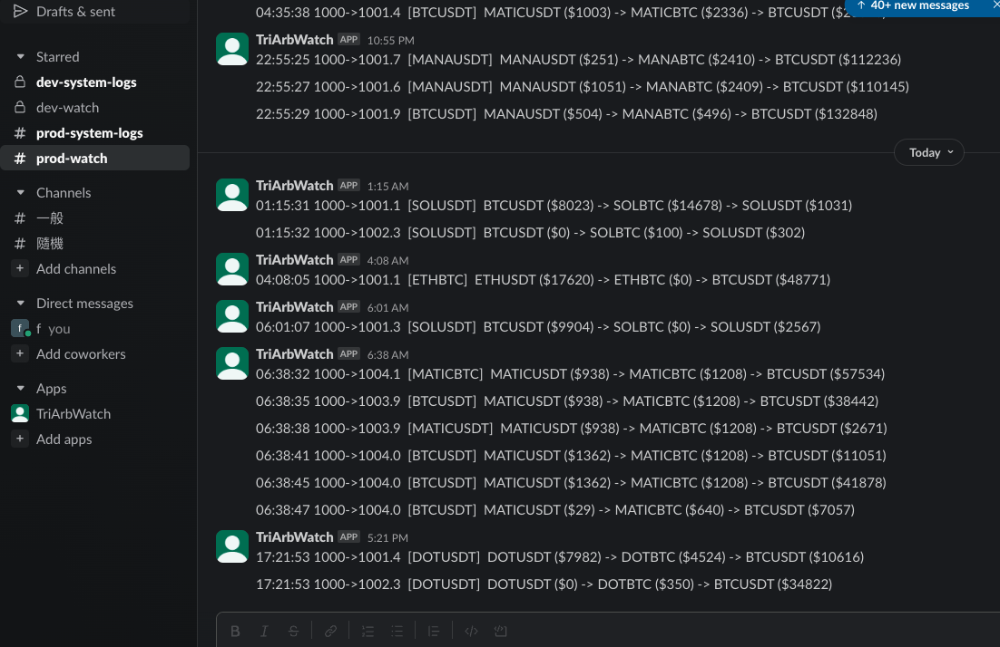

# DEPRECATED

This is an experimental repo and no longer maintained.

There's not much chance for making money through triangular arbitrage in crypto trading.

# Introduction

This is a Go application for real-time detection of triangular arbitrage opportunities in cryptocurrency markets.



### Features

* Efficient Real-Time crypto pairs tracking
* Compatible with multiple crypto exchanges
* Precision calculation with fees included
* Notify slack channel when opportunities show up

# Run

```
make run
```

# Deployment

### First time deployment

```
make first_time
```

log in EC2

```
cd /home/ec2-user/app/
sudo cp crypto-triangular-arbitrage-watch.service /etc/systemd/system/
sudo systemctl daemon-reload
sudo systemctl start crypto-triangular-arbitrage-watch
sudo systemctl status crypto-triangular-arbitrage-watch
```

### Deploy

1) Copy `config.yml` to `prod-config.yml`

2) Change `ENV` to `prod` in `prod-config.yml`

3) Run

```
make deploy
```

# Debug mode

`config.yml`:

```
DEBUG_PRINT_MESSAGE: true
DEBUG_PRINT_MOST_PROFIT: true
```

# Manual test

* testnet doesn't seem to support all orderbooks.
* If no one trades BTCUSDT, ETHUSDT or BTCETH, combination calculation won't be conducted. Then there is no output for 'watch'.

Run (optional, it's just for receiving order status)

    make run

Buy BTC with $10 USDT

    make buy qty=10                         // default is BTCUSDT
    make buy qty=10 sym=ETHUSDT

Sell BTC with qty=0.000294

    make sell qty=0.000294                  // default is BTCUSDT
    make sell qty=0.000294 sym=ETHUSDT

Get Instruments Info

    maek instrument                         // default is BTCUSDT
    make instrument sym=ETHUSDT

Generate instruments file

    make generate_instruments

Test tri trade

    make trii qty=10

All symbols

    make all_symbols

Get order history

    make order_history
    make order_history limit=3

# Bybit API response

### public channel

subscribe orderbook

    {"success":true,"ret_msg":"subscribe","conn_id":"d8189029-b0b8-415e-89dd-dbaa99bebecd","op":"subscribe"}

ping on orderbook connection

    {"success":true,"ret_msg":"pong","conn_id":"8c207ac5-8a20-40d8-963e-03e6b9cfe080","op":"ping"}

orderbook

    {"topic":"orderbook.1.BTCUSDT","ts":1699764797519,"type":"delta","data":{"s":"BTCUSDT","b":[],"a":[["32499.27","0.011534"],["32529.54","0"]],"u":873489,"seq":1253141792}}

### private channel

auth

    {"success":true,"ret_msg":"","op":"auth","conn_id":"cl48jvldaugj6f98t3o0-97id"}

subscribe order status

    {"success":true,"ret_msg":"","op":"subscribe","conn_id":"cl48jjpqo29jk1nbp4e0-97x2"}

ping on order status connection

    {"op":"pong","args":["1699766561376"],"conn_id":"cl48jjpqo29jk1nbp4e0-98gm"}

execution.spot

    {"topic":"execution.spot","id":"100401071-20000-1253141306","creationTime":1699764599843,"data":[{"category":"spot","symbol":"BTCUSDT","closedSize":"","execFee":"0.000000306","execId":"2100000000047469164","execPrice":"32635.00","execQty":"0.000306","execType":"Trade","execValue":"9.98631000","feeRate":"0.001","tradeIv":"","markIv":"","blockTradeId":"","markPrice":"","indexPrice":"","underlyingPrice":"","leavesQty":"0.000000","orderId":"1552132392821724672","orderLinkId":"1552132392821724673","orderPrice":"0","orderQty":"0.000000","orderType":"Market","stopOrderType":"","side":"Buy","execTime":"1699764599837","isLeverage":"0","isMaker":false,"seq":1253141306}]}

order.spot

    {"topic":"order.spot","id":"100401071-20000-1253141306","creationTime":1699764599843,"data":[{"category":"spot","symbol":"BTCUSDT","orderId":"1552132392821724672","orderLinkId":"1552132392821724673","blockTradeId":"","side":"Buy","positionIdx":0,"orderStatus":"PartiallyFilledCanceled","cancelType":"UNKNOWN","rejectReason":"EC_CancelForNoFullFill","timeInForce":"IOC","isLeverage":"0","price":"0","qty":"10.000000","avgPrice":"32635","leavesQty":"0.000000","leavesValue":"0.01369000","cumExecQty":"0.000306","cumExecValue":"9.98631000","cumExecFee":"0.000000306","orderType":"Market","stopOrderType":"","orderIv":"","triggerPrice":"0.00","takeProfit":"0.00","stopLoss":"0.00","triggerBy":"","tpTriggerBy":"","slTriggerBy":"","triggerDirection":0,"placeType":"","lastPriceOnCreated":"32634.91","closeOnTrigger":false,"reduceOnly":false,"smpGroup":0,"smpType":"None","smpOrderId":"","createdTime":"1699764599837","updatedTime":"1699764599841","feeCurrency":"BTC"}]}
    {"topic":"order.spot","id":"100401071-20000-1253189597","creationTime":1699777868989,"data":[{"category":"spot","symbol":"BTCUSDT","orderId":"1552243702477624832","orderLinkId":"1552243702477624833","blockTradeId":"","side":"Sell","positionIdx":0,"orderStatus":"Filled","cancelType":"UNKNOWN","rejectReason":"EC_NoError","timeInForce":"IOC","isLeverage":"0","price":"0","qty":"0.001936","avgPrice":"32178.11355371","leavesQty":"0.000000","leavesValue":"0.00000000","cumExecQty":"0.001936","cumExecValue":"62.29682784","cumExecFee":"0.06229682784","orderType":"Market","stopOrderType":"","orderIv":"","triggerPrice":"0.00","takeProfit":"0.00","stopLoss":"0.00","triggerBy":"","tpTriggerBy":"","slTriggerBy":"","triggerDirection":0,"placeType":"","lastPriceOnCreated":"32224.00","closeOnTrigger":false,"reduceOnly":false,"smpGroup":0,"smpType":"None","smpOrderId":"","createdTime":"1699777868982","updatedTime":"1699777868986","feeCurrency":"USDT"}]}

wallet

    {"id":"100401071d62a16b0-cc3a-41d7-b473-086b6cde0036","topic":"wallet","creationTime":1699764599844,"data":[{"accountIMRate":"0","accountMMRate":"0","totalEquity":"100.27419876","totalWalletBalance":"99.70879947","totalMarginBalance":"99.70879947","totalAvailableBalance":"99.70879947","totalPerpUPL":"0","totalInitialMargin":"0","totalMaintenanceMargin":"0","coin":[{"coin":"USDC","equity":"0","usdValue":"0","walletBalance":"0","availableToWithdraw":"0","availableToBorrow":"","borrowAmount":"0","accruedInterest":"0","totalOrderIM":"0","totalPositionIM":"0","totalPositionMM":"0","unrealisedPnl":"0","cumRealisedPnl":"0","bonus":"0","collateralSwitch":true,"marginCollateral":true,"locked":"0"},{"coin":"BTC","equity":"0.0003058","usdValue":"11.30798592","walletBalance":"0.0003058","availableToWithdraw":"0.0003058","availableToBorrow":"","borrowAmount":"0","accruedInterest":"0","totalOrderIM":"0","totalPositionIM":"0","totalPositionMM":"0","unrealisedPnl":"0","cumRealisedPnl":"-0.00000619","bonus":"0","collateralSwitch":true,"marginCollateral":true,"locked":"0"},{"coin":"USDT","equity":"88.94040055","usdValue":"88.96621283","walletBalance":"88.94040055","availableToWithdraw":"88.94040055","availableToBorrow":"","borrowAmount":"0","accruedInterest":"0","totalOrderIM":"0","totalPositionIM":"0","totalPositionMM":"0","unrealisedPnl":"0","cumRealisedPnl":"-0.17895808","bonus":"0","collateralSwitch":true,"marginCollateral":true,"locked":"0"}],"accountLTV":"0","accountType":"UNIFIED"}]}


# Calculation

### USDT->BTC->ETH->USDT

BTCUSDT (base: BTC, quote: USDT)

    BTC = USDT / ask.price

ETHBTC (base: ETH, quote: BTC) (BUY)

    ETH = BTC / ask.price

ETHUSDT (base: ETH, quote: USDT)

    USDT = ETH * bid.price

e.g.

    baseQuote:  false
    0  BTCUSDT  bid price: 37074, bid size: 0.748953, ask price: 37074.01, ask size: 3.636181
    1  ETHBTC  bid price: 0.055199, bid size: 0.5, ask price: 0.0552, ask size: 0.04
    2  ETHUSDT  bid price: 2046.98, bid size: 0.44718, ask price: 2046.99, ask size: 52.50055


### USDT->ETH->BTC->USDT


ETHUSDT (base: ETH, quote: USDT)

    ETH = USDT / ask.price

ETHBTC (base: ETH, quote: BTC) (SELL)

    BTC = ETH * bid.price

BTCUSDT (base: BTC, quote: USDT)

    USDT = BTC * bid.price

e.g.

    baseQuote:  true
    0  ETHUSDT  bid price: 2044.92, bid size: 0.21027, ask price: 2044.93, ask size: 34.85644
    1  ETHBTC  bid price: 0.055166, bid size: 0.388, ask price: 0.055182, ask size: 0.342
    2  BTCUSDT  bid price: 37069.38, bid size: 0.050048, ask price: 37069.39, ask size: 6.355316

# Further explaination for terms in Bybit API

### Bid vs Ask

* Bid: The bid price is the highest price that a buyer (or buyers) is willing to pay for an asset
* Ask: The lowest price at which a seller (or sellers) is willing to sell their asset.

### symbol instrument - minOrderQty vs maxOrderQty vs minOrderAmt vs maxOrderAmt

minOrderQty and maxOrderQty deal with the quantity of the base currency in a trade, while minOrderAmt and maxOrderAmt refer to the total value of the trade in terms of the quote currency

For example: `BTCUSDT` instrument (`BTC` is base currency and `USDT` is quote currency):

    &{RetCode:0 RetMsg:OK Result:{Category:spot List:[{Symbol:BTCUSDT BaseCoin:BTC QuoteCoin:USDT Status:Trading LotSizeFilter:{BasePrecision:0.000001 QuotePrecision:0.00000001 MinOrderQty:0.000048 MaxOrderQty:200 MinOrderAmt:1 MaxOrderAmt:2000000}}]} RetExtInfo:map[] Time:1700408846020}

Test cases:

* Use `0.9` USDT to buy BTC: fail, `Order value exceeded lower limit`
* Use `1` USDT to buy BTC: success
* Sell `0.000047` BTC: fail, `Order quantity exceeded lower limit`
* Sell `0.000048` BTC: success

For example: `ETHBTC` instrument (`ETH` is base currency and `BTC` is quote currency):

    &{RetCode:0 RetMsg:OK Result:{Category:spot List:[{Symbol:ETHBTC BaseCoin:ETH QuoteCoin:BTC Status:Trading LotSizeFilter:{BasePrecision:0.001 QuotePrecision:0.000000001 MinOrderQty:0.01 MaxOrderQty:1000 MinOrderAmt:0.01 MaxOrderAmt:1}}]} RetExtInfo:map[] Time:1700408896992}

Test cases:

* `0.009` BTC -> ETH: fail, `170140 Order value exceeded lower limit`
* `0.01` BTC -> ETH: success
* `0.02` BTC -> ETH: success
* `0.009` ETH -> BTC: fail, `170136 Order quantity exceeded lower limit`
* `0.01` ETH -> BTC: success
* `0.02` ETH -> BTC: success

> Make no sense, is it bug?

NOTE: The instrument in TESTNET and MAINNET can be different such as `ETHBUC`

in TESTNET

    &{RetCode:0 RetMsg:OK Result:{Category:spot List:[{Symbol:ETHBTC BaseCoin:ETH QuoteCoin:BTC Status:Trading LotSizeFilter:{BasePrecision:0.001 QuotePrecision:0.000000001 MinOrderQty:0.01 MaxOrderQty:1000 MinOrderAmt:0.01 MaxOrderAmt:1}}]} RetExtInfo:map[] Time:1700408896992}

in MAINNET

    &{RetCode:0 RetMsg:OK Result:{Category:spot List:[{Symbol:ETHBTC BaseCoin:ETH QuoteCoin:BTC Status:Trading LotSizeFilter:{BasePrecision:0.001 QuotePrecision:0.000000001 MinOrderQty:0.003 MaxOrderQty:271.90273271 MinOrderAmt:0.0002 MaxOrderAmt:13.91}}]} RetExtInfo:map[] Time:1700407813998}

# Troubleshooting

### `Order value exceeded lower limit.`

It means that the total value is below the minimum threshold. Solution is trading more value to excceed the threshold

### Order got cancelled

req to spot market sell order

    map[category:spot orderType:Market qty:0.247 side:Sell symbol:ETHBTC]

private channel

    order.spot: {Symbol:ETHBTC Side:Sell CumQty:0.000 CumValue:0.000000000 CumFee:0 Status:Cancelled Type:Market}

order status

      {
        "symbol": "ETHBTC",
        "orderType": "Market",
        "orderLinkId": "1700384547433",
        "orderId": "1557332891158189568",
        "cancelType": "UNKNOWN",
        "orderStatus": "Cancelled",
        "cumExecValue": "0.000000000",
        "rejectReason": "EC_ReachRiskPriceLimit",
        "createdTime": "1700384547549",
        "updatedTime": "1700384547553",
        "side": "Sell",
        "triggerPrice": "0.000000",
        "cumExecFee": "0",
        "cumExecQty": "0.000",
        "reduceOnly": false,
        "qty": "0.185"
      }

Reason:

Don't know, it's really weird. Successful order can also get it

    "orderStatus":"PartiallyFilledCanceled",
    "rejectReason":"EC_ReachRiskPriceLimit",

Solution: Try it after a while

Bybit's response is not very consistent. I think the only reliable way is `orderStatus` (`PartiallyFilledCanceled` or `Filled`)


# TODO

* P1
    * minimum threshold check
    * 2 ways to check if order is filled
        * ws `oder.spot`
        * order history
    * Tri-trade lock
* P2
    * Size of Ask and Bid check
    * graceful shutdown
* P3
    * mysql to store the process of trade
    * Add unit test
